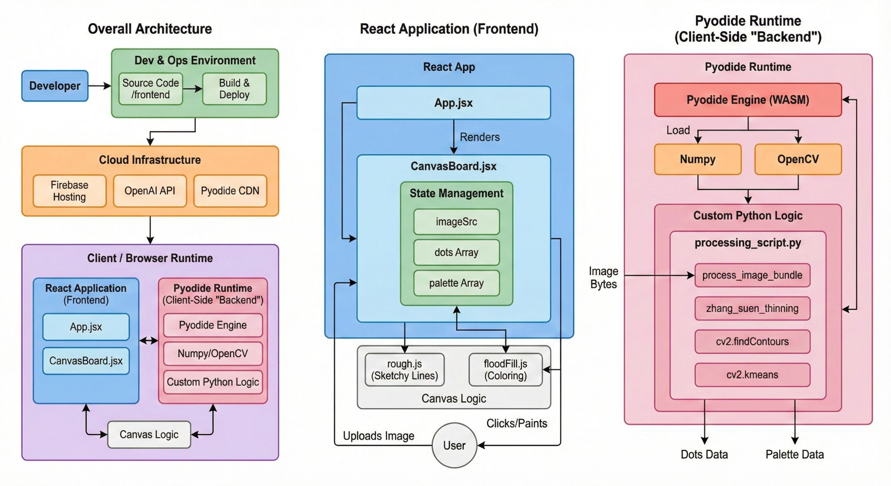

# AI Drawing Book 🎨✨

**Live at:** [https://aidrawingbook.manideep.info/](https://aidrawingbook.manideep.info/)

<video src="https://github.com/user-attachments/assets/ebd58752-1790-42a1-a239-e2037224de29" controls="controls" style="max-width: 100%;"></video>

## Building an AI Christmas Gift 🎄
With Christmas approaching, I’ve been thinking about what to give my cousin’s kids. Instead of a store-bought toy, I decided to use my AI engineering skills to build something that captures the same childhood magic, but with a modern twist.

## 🏗️ The Architecture: A Backend in the Browser

Most AI apps send images to a heavy Python server. I decided to do the opposite: I’m bringing the server to the user.

*   **Pyodide & WASM:** I'm using WebAssembly to load a full Python 3.11 environment directly in the browser.
*   **Zero-Cost Compute:** By running the "backend" logic on the client's machine, I pay $0 for image processing servers, and the user's data stays private on their device.
*   **Firebase Hosting:** The entire stack is deployed as a lightning-fast Static Site (SPA), using Firebase’s global CDN for sub-second load times.

### 🧪 The Computer Vision Pipeline
Turning a raw DALL-E 3 (by OpenAI) generation into a colorable outline requires more than just a filter. Inside the browser-side Python environment, I’ve setup a specialized processing pipe:

1.  **Zhang-Suen Thinning:** This algorithm "skeletonizes" thick AI-generated lines into clean, 1-pixel paths. This ensures the coloring "boundaries" are precise and clean.
2.  **K-Means Clustering (OpenCV):** The system analyzes the original AI image to automatically extract a 5-color palette, giving kids a "suggested colors" tray.

## 🛠️ Tech Stack

*   **Frontend:** React 19 + Vite
*   **Styling:** Tailwind CSS 4.0
*   **Rendering:** Rough.js (for that "hand-drawn" feel)
*   **Compute:** WebAssembly (Pyodide) + OpenCV
*   **AI:** OpenAI DALL-E 3
*   **Infrastructure:** Firebase Hosting & Firestore
