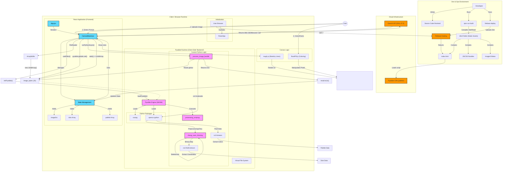

# System Architecture

```mermaid
graph TD
    %% DO NOT RENDER IN EDITOR - VIEW ON GITHUB OR MERMAID.LIVE
    
    subgraph "Dev & Ops Environment"
        Dev[Developer]
        Code["Source Code /frontend"]
        BuildCmd["npm run build"]
        DistFolder["/dist Folder (Static Assets)"]
        DeployCmd["firebase deploy"]
        
        Dev -- Writes --> Code
        Dev -- Runs --> BuildCmd
        BuildCmd -- Compiles Vite/React --> DistFolder
        DistFolder -- Contains --> IndexHtml[index.html]
        DistFolder -- Contains --> JSBundles["JS/CSS Bundles"]
        DistFolder -- Contains --> Assets["Images/Videos"]
        Dev -- Runs --> DeployCmd
        DeployCmd -- Uploads Dist --> FirebaseCloud
    end

    subgraph "Cloud Infrastructure"
        FirebaseCloud[Firebase Hosting]
        OpenAI["OpenAI API (DALL-E 3)"]
        PyodideCDN["Pyodide CDN (jsdelivr)"]
    end

    subgraph "Client / Browser Runtime"
        direction TB
        
        subgraph "Initialization"
            Browser[User Browser] -- GET / --> FirebaseCloud
            FirebaseCloud -- Returns --> IndexHtml
            IndexHtml -- Loads script --> PyodideCDN
            Browser -- Hydrates --> ReactApp
        end

        subgraph "React Application (Frontend)"
            AppComp[App.jsx]
            CanvasBoard[CanvasBoard.jsx]
            StateMgr[State Management]
            
            AppComp -- Renders --> CanvasBoard
            CanvasBoard -- Manages --> StateMgr
            StateMgr -- Holds --> ImageState["imageSrc"]
            StateMgr -- Holds --> DotsState["dots Array"]
            StateMgr -- Holds --> PaletteState["palette Array"]
        end

        subgraph "Pyodide Runtime (Client-Side 'Backend')"
            PyCore["Pyodide Engine (WASM)"]
            PyFS[Virtual File System]
            
            subgraph "Python Packages"
                Numpy[numpy]
                OpenCV[opencv-python]
            end
            
            subgraph "Custom Python Logic"
                ProcessScript[processing_script.py]
                Func_Process["process_image_bundle"]
                Func_Thinning["zhang_suen_thinning"]
                Func_Contours["cv2.findContours"]
                Func_KMeans["cv2.kmeans"]
            end
            
            PyCore -- Loads --> Numpy
            PyCore -- Loads --> OpenCV
            PyCore -- Executes --> ProcessScript
        end

        subgraph "Canvas Logic"
            RoughJS["rough.js (Sketchy Lines)"]
            FloodFill["floodFill.js (Coloring)"]
        end
    end

    %% DATA FLOWS

    %% 1. Initialization Flow
    CanvasBoard -- "useEffect()" --> InitPy["initPyodide()"]
    InitPy -- "loadPyodide()" --> PyCore

    %% 2. Classic Upload Flow
    User((User)) -- "1. Uploads Image" --> CanvasBoard
    CanvasBoard -- "FileReader" --> ArrayBuffer
    ArrayBuffer -- "new Uint8Array()" --> ImgBytes["image_bytes (JS)"]
    CanvasBoard -- "pyodide.globals.set()" --> ImgBytes
    ImgBytes -.-> PyCore
    CanvasBoard -- "runPythonAsync()" --> Func_Process
    Func_Process -- "Reads global" --> ImgBytes
    
    %% 3. Magic Generator Flow
    User -- "2. Enters Prompt" --> CanvasBoard
    CanvasBoard -- "Unsafe Browser Call" --> OpenAI
    OpenAI -- "Returns B64 JSON" --> CanvasBoard
    CanvasBoard -- "atob() -> Uint8Array" --> ImgBytes
    
    %% 4. Image Processing Flow (Python)
    Func_Process -- "cv2.imdecode" --> OpenCV
    OpenCV -- "Preprocessing/Otsu" --> Func_Thinning
    Func_Thinning -- "Skeletonize" --> Func_Thinning
    Func_Thinning -- "Binary Map" --> Func_Contours
    Func_Contours -- "Extract Coordinates" --> DotsData[Dots Data]
    OpenCV -- "Pixel Data" --> Func_KMeans
    Func_KMeans -- "Extract Colors" --> PaletteData[Palette Data]
    
    %% 5. Return Flow
    Func_Process -- "Returns Dict" --> PyConvert["result.toJs()"]
    PyConvert -- "Updates State" --> StateMgr

    %% 6. Rendering Flow
    StateMgr -- "Data" --> CanvasBoard
    CanvasBoard -- "Draw Lines" --> RoughJS
    RoughJS -- "Render on" --> HtmlCanvas["<canvas>"]
    User -- "3. Clicks/Paints" --> FloodFill
    FloodFill -- "Manipulates Pixels" --> HtmlCanvas

    classDef python fill:#f9f,stroke:#333,stroke-width:2px;
    classDef react fill:#61dafb,stroke:#333,stroke-width:2px,color:black;
    classDef cloud fill:#ff9900,stroke:#333,stroke-width:2px;
    
    class ProcessScript,Func_Process,Func_Thinning,PyCore python;
    class CanvasBoard,AppComp,StateMgr react;
    class FirebaseCloud,OpenAI,PyodideCDN cloud;
```
